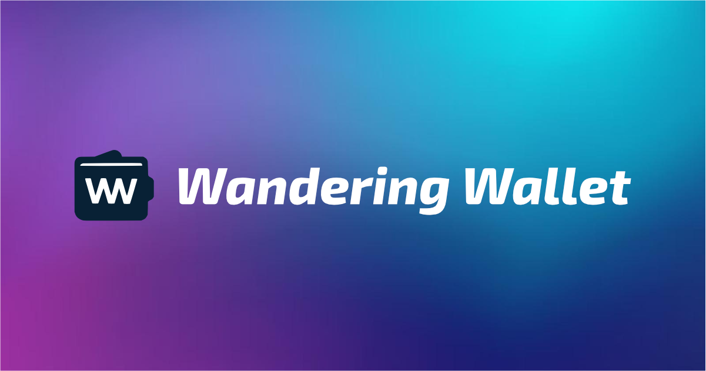

# Wandering Wallet
_v1.0.0_



A web application to track trip expenses using a React frontend and Node.js backend, with automatic storage to Google Sheets.

> [!IMPORTANT]  
> The app is in Portuguese and requires the google sheet fields to be in Portuguese as well.

## Motivation

While planning a trip with my partner, we needed a simple way to keep track of our shared expenses. This app was created to make it easy to log every expense as it happens, with seamless integration to Google Sheets for straightforward analysis. By centralizing our spending data, we can always see if we're staying on budget and understand exactly how much we've spent and on what.

## Features

- Google Authentication with email restriction
- Simple expense entry form with category, amount and description
- Direct integration with Google Sheets

## Project Structure

```
trip-expenses/
├── frontend/           # React + Vite frontend
├── backend/           # Node.js + Express backend
└── Dockerfile         # Multi-stage Docker build file
```

## Prerequisites

- Node.js v24 or higher (an `.nvmrc` file is included for nvm users)
- A Google Cloud Project with the following APIs enabled:
  - Google Sheets API
  - Google OAuth 2.0
- A Google Service Account with access to Sheets API
- A Google OAuth 2.0 Client ID for authentication

## Setup Instructions

### 1. Node.js Setup

If you use nvm (Node Version Manager), simply run:
```bash
nvm use
```
This will automatically switch to Node.js 24 as specified in the `.nvmrc` file.

If you don't use nvm, ensure you have Node.js 24 or higher installed manually.

### 2. Google Cloud Setup

#### Google Sheets Configuration

1. Create a new Google Sheet
2. Note down the Sheet ID from the URL (the long string between /d/ and /edit)
3. Set up Google Cloud Project:
   - Go to [Google Cloud Console](https://console.cloud.google.com)
   - Create a new project or select existing one
   - Enable Google Sheets API
   - Create a Service Account
   - Download the JSON credentials
   - Share your Google Sheet with the service account email

#### Google OAuth Configuration

1. Set up OAuth 2.0:
   - Go to [Google Cloud Console](https://console.cloud.google.com)
   - Navigate to your project
   - Go to APIs & Services > Credentials
   - Click "Create Credentials" and select "OAuth client ID"
   - Select "Web application" as the application type
   - Add your application's domain to the authorized JavaScript origins
   - Add your application's redirect URI (e.g., http://localhost:5173 for development)
   - Note down the Client ID

### 2. Backend Setup

1. Navigate to the backend directory:
   ```bash
   cd backend
   ```

2. Install dependencies:
   ```bash
   npm install
   ```

3. Create a configuration file:
   - Copy `app-config-example.json` to `app-config.json`
   - Edit `app-config.json` to set your Google Sheet ID, allowed emails, and other settings

4. Prepare your Google Service Account credentials file (downloaded from Google Cloud Console).

5. Create a `.env` file from the example:
   ```bash
   cp example.env .env
   ```

6. Edit `.env` to set the following variables (use file paths for config and credentials):
   ```
   PORT=3001
   APP_CONFIG_PATH=./app-config.json
   GOOGLE_SERVICE_ACCOUNT_JSON=./client_secret_xxx.json
   GOOGLE_CLIENT_ID=your_oauth_client_id_here
   ```

   - `APP_CONFIG_PATH`: Path to your backend config file (e.g., `./app-config.json`)
   - `GOOGLE_SERVICE_ACCOUNT_JSON`: Path to your Google service account JSON file
   - `GOOGLE_CLIENT_ID`: Your OAuth 2.0 Client ID

For more details, see [backend/README.md](backend/README.md).

### 3. Frontend Setup

1. Navigate to the frontend directory:
   ```bash
   cd frontend
   ```

2. Install dependencies:
   ```bash
   npm install
   ```

3. Create `.env` file:
   ```bash
   cp .env.example .env
   ```

4. Update `.env` with your configuration:
   ```
   VITE_API_URL=http://localhost:3001
   ```

## Running the Application

1. Start the backend server (in the backend directory):
   ```bash
   npm run dev
   ```

2. Start the frontend development server (in the frontend directory):
   ```bash
   npm run dev
   ```

3. Access the application at `http://localhost:5173`
4. Sign in using your Google account (must be an authorized email)

## Usage

1. Sign in with your Google account (must be one of the allowed emails in your config)
2. Enter the expense amount in the "Amount" field
2. Provide a description for the expense
3. Click "Add Expense" to submit
4. The expense will be automatically added to your Google Sheet with a timestamp

## Development

- Backend runs on port 3001 by default
- Frontend development server runs on port 5173
- Hot reload is enabled for both frontend and backend

## Docker Compose Deployment

You can run the entire application using Docker Compose.

1. Make sure you have the following files in the backend directory:
   - `app-config.json` (your backend configuration)
   - `client_secret.json` (your Google service account credentials)

2. Edit `docker-compose.yml` to set your actual `GOOGLE_CLIENT_ID` in the backend environment section.

3. Start the services:
   ```bash
   docker compose up --build
   ```

- The backend will be available at `http://localhost:3001`
- The frontend will be available at `http://localhost:3000`

The backend service mounts `app-config.json` and `client_secret.json` as read-only volumes and uses environment variables for configuration.

### Environment Variables

The backend service uses:
- `PORT`: The port to run the server (default: 3001)
- `APP_CONFIG_PATH`: Path to your backend config file (e.g., `/app/app-config.json`)
- `GOOGLE_SERVICE_ACCOUNT_JSON`: Path to your Google service account JSON file (e.g., `/app/client_secret.json`)
- `GOOGLE_CLIENT_ID`: Your OAuth 2.0 Client ID

For custom deployments or advanced usage, you can still use Docker directly as described below.

## Docker Deployment

You can also run the backend or frontend individually using Docker. See the `docker-compose.yml` and service Dockerfiles for details.
