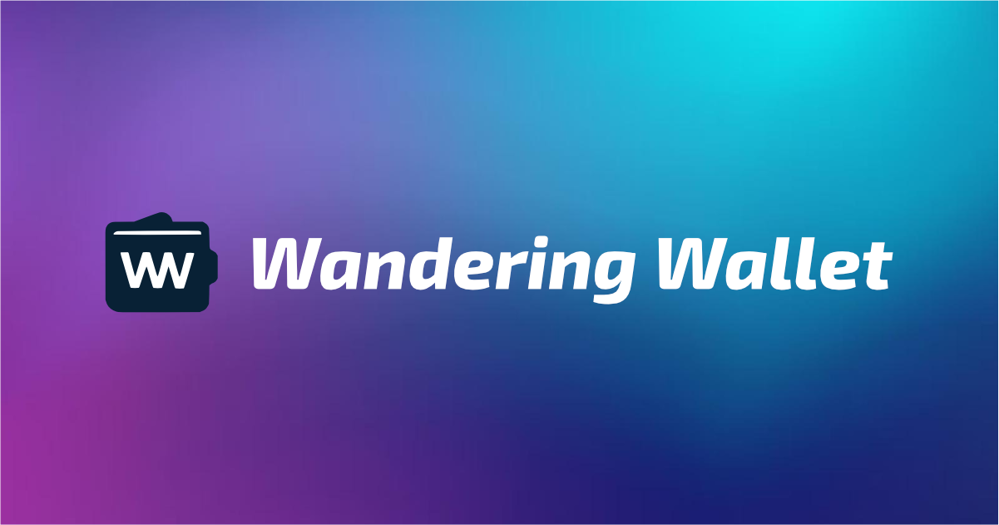

# Wandering Wallet
_v1.0.0_



A web application to track trip expenses using a React frontend and Node.js backend, with automatic storage to Google Sheets.

> [!IMPORTANT]  
> The app is in Portuguese and requires the google sheet fields to be in Portuguese as well.

## Motivation

While planning a trip with my partner, we needed a simple way to keep track of our shared expenses. This app was created to make it easy to log every expense as it happens, with seamless integration to Google Sheets for straightforward analysis. By centralizing our spending data, we can always see if we're staying on budget and understand exactly how much we've spent and on what.

## Features

- Google Authentication with email restriction
- Simple expense entry form with category, amount and description
- Direct integration with Google Sheets

## Project Structure

```
wandering-wallet/
├── .env.example              # copy to .env (gitignored)
├── app-config.example.json   # copy to app-config.json (gitignored)
├── frontend/                 # React + Vite
├── backend/                  # Node.js + Express
└── docker-compose.yml
```

All machine-local config lives at the **repo root**: `.env`, `app-config.json`, `google-service-account.json`. Do not edit `docker-compose.yml` for secrets or URLs.

## Prerequisites

- Node.js v24 or higher (an `.nvmrc` file is included for nvm users)
- A Google Cloud Project with the following APIs enabled:
  - Google Sheets API
  - Google OAuth 2.0
- A Google Service Account with access to Sheets API
- A Google OAuth 2.0 Client ID for authentication

## Setup Instructions

### 1. Node.js Setup

If you use nvm (Node Version Manager), simply run:
```bash
nvm use
```
This will automatically switch to Node.js 24 as specified in the `.nvmrc` file.

If you don't use nvm, ensure you have Node.js 24 or higher installed manually.

### 2. Google Cloud Setup

#### Google Sheets Configuration

1. Create a new Google Sheet
2. Note down the Sheet ID from the URL (the long string between /d/ and /edit)
3. Set up Google Cloud Project:
   - Go to [Google Cloud Console](https://console.cloud.google.com)
   - Create a new project or select existing one
   - Enable Google Sheets API
   - Create a Service Account
   - Download the JSON credentials
   - Share your Google Sheet with the service account email

#### Google OAuth Configuration

1. Set up OAuth 2.0:
   - Go to [Google Cloud Console](https://console.cloud.google.com)
   - Navigate to your project
   - Go to APIs & Services > Credentials
   - Click "Create Credentials" and select "OAuth client ID"
   - Select "Web application" as the application type
   - Add your application's domain to the authorized JavaScript origins
   - Add your application's redirect URI (e.g., http://localhost:5173 for development)
   - Note down the Client ID

### 3. App config (repo root)

All of this stays on your machine — it is gitignored.

```bash
cp .env.example .env
cp app-config.example.json app-config.json
```

1. Put the Google service-account JSON at **`./google-service-account.json`**.
2. Edit `app-config.json`: participant names + Google emails, currencies, splits (`1/2`, `2/3`, `2/5`).
3. Edit `.env`:

```
PORT=3001
APP_CONFIG_FILE=./app-config.json
GOOGLE_SERVICE_ACCOUNT_FILE=./google-service-account.json
GOOGLE_CLIENT_ID=your_oauth_client_id_here
GOOGLE_SHEET_ID=your_google_sheet_id_here
JWT_SECRET=your_secret_here
FRONTEND_ORIGIN=http://localhost:5173
VITE_BASE_URL=http://localhost:5173
VITE_API_URL=http://localhost:3001
```

- `JWT_SECRET`: generate with `node -e "console.log(require('crypto').randomBytes(64).toString('hex'))"`
- `FRONTEND_ORIGIN`: CORS origin (`http://localhost:5173` for Vite, `http://localhost:3000` for Docker UI)
- `VITE_*`: baked into the frontend at build time. For Docker on this host use `VITE_BASE_URL=http://localhost:3000` and `VITE_API_URL=http://localhost:3001`

### 4. Local install

```bash
cd backend && npm install && cd ../frontend && npm install
```

## Running the Application

From `backend/`: `npm run dev` (reads root `.env`).  
From `frontend/`: `npm run dev` (same).  
Open http://localhost:5173 and sign in with an allowed Google account.

## Usage

1. Sign in with your Google account (must be one of the allowed emails in your config)
2. Enter the expense amount in the "Amount" field
2. Provide a description for the expense
3. Click "Add Expense" to submit
4. The expense will be automatically added to your Google Sheet with a timestamp

## Development

- Backend runs on port 3001 by default
- Frontend development server runs on port 5173
- Hot reload is enabled for both frontend and backend

## Docker Compose Deployment

Config is **not** in `docker-compose.yml`. After `git pull`, only root `.env` / JSON files matter.

1. Same three files as local setup, at the repo root:
   - `.env`
   - `app-config.json`
   - `google-service-account.json`
2. For the Docker UI on this machine, set in `.env`:
   ```
   FRONTEND_ORIGIN=http://localhost:3000
   VITE_BASE_URL=http://localhost:3000
   VITE_API_URL=http://localhost:3001
   ```
3. Start:
   ```bash
   docker compose up --build
   ```

- Frontend: http://localhost:3000
- Backend: http://localhost:3001

Changing `VITE_*` requires a rebuild (`--build`). Other env vars apply on container restart.

## Docker Deployment

You can also run the backend or frontend individually using Docker. See `docker-compose.yml` and the service Dockerfiles.
